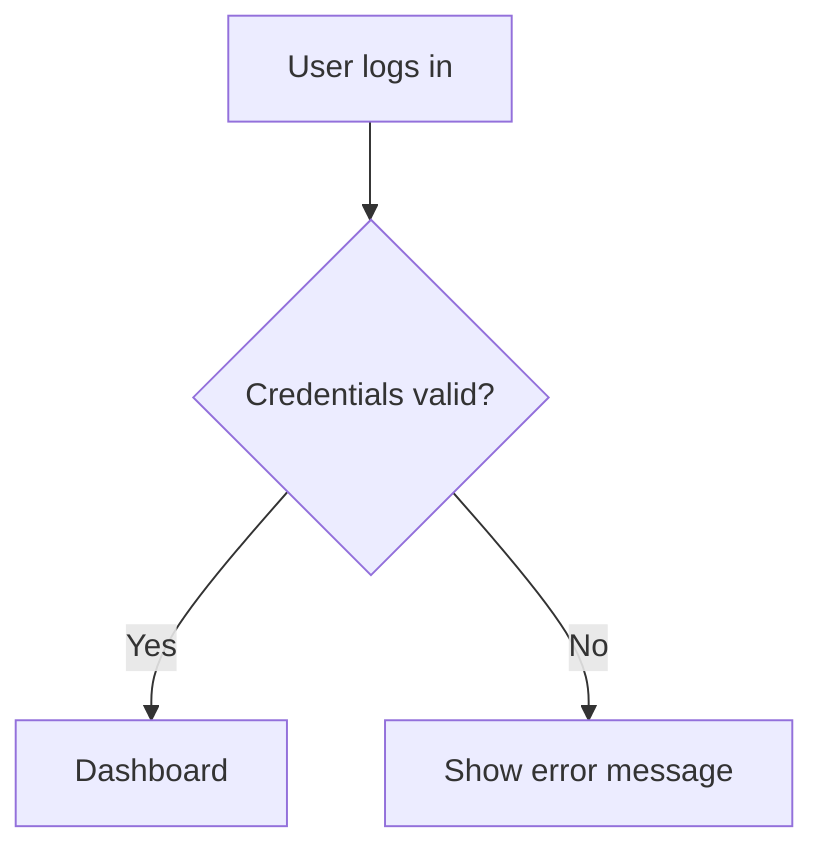

# 🧠 Local AI Flowchart Generator with Ollama + Mistral

This project allows you to generate flowcharts in Mermaid.js format using natural language prompts — powered by the `mistral` model running locally with [Ollama](https://ollama.com).

---

## 🚀 Quick Setup Guide

### 1. Install Ollama

Go to the official site and download Ollama for your operating system:

👉 [https://ollama.com/download](https://ollama.com/download)

Once installed, open your terminal and verify it's working:

```bash
ollama --version
```

---

### 2. Pull the Mistral Model

To download and prepare the Mistral model (~4GB), run:

```bash
ollama pull mistral
```

After downloading, you can test it interactively:

```bash
ollama run mistral
```

---

### 3. Start Ollama (if not already running)

Ollama should start automatically when you run a model, but you can also launch the daemon manually:

```bash
ollama serve
```

> The API will be available at: `http://localhost:11434`

---

## 📡 Example API Request

You can send prompts to Mistral via HTTP:

```bash
curl http://localhost:11434/api/chat -d '{
  "model": "mistral",
  "messages": [
    {"role": "user", "content": "Create a Mermaid.js flowchart for user login process"}
  ]
}'
```

---

## 🔧 Integrating with Your Node.js Backend

In your Express server, send prompts like this:

```js
const axios = require("axios");

const response = await axios.post("http://localhost:11434/api/chat", {
  model: "mistral",
  messages: [
    { role: "system", content: "You generate flowcharts using Mermaid.js format." },
    { role: "user", content: "User logs in, system verifies, shows dashboard or error." }
  ],
  stream: false
});
```

---

## ✅ Output Example



---

## ✅ Requirements

- Node.js (v16+ recommended)
- Ollama installed
- `mistral` model pulled
- Internet (only during initial pull)

---

## 📦 Optional Models to Try

| Model       | Description               |
|-------------|---------------------------|
| `llama2`    | General LLM, 7B params     |
| `codellama` | Code-focused model         |
| `gemma`     | Lightweight, fast responses |

---

Built with ❤️ using local AI.